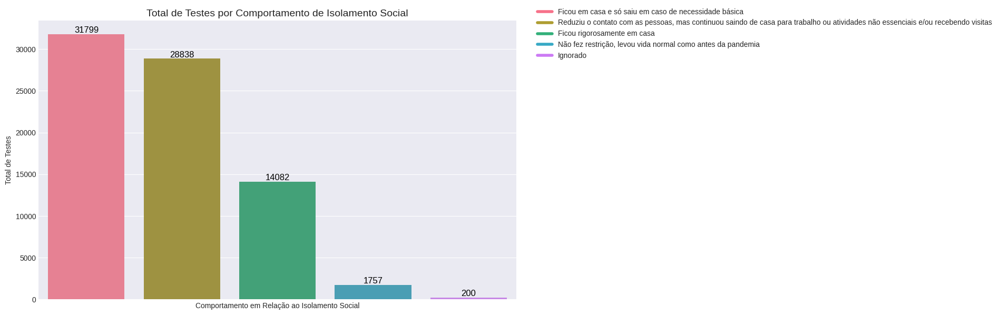

# Preparacao operacional com base em dados para pandemias


### Colaboradores
@bmuller70/[Bruno Müller](https://www.linkedin.com/in/bruno-muller-335630196/) :computer:		

@marialuisamartins/[Maria Luisa Martins Brasil](https://www.linkedin.com/in/marialuisamartinsb/) :computer:	

@marialmrt97/[Maria Luiza Martins](https://www.linkedin.com/in/maria-luiza-martins-4115b213b/) :computer:	

@Pahmxx/[Phaola Oliveira Silva](https://www.linkedin.com/in/phaola-oliveira/) :computer:

## Introdução

Para construção dessa análise partimos da perspectiva de um hospital público localizado na cidade de São Paulo que opera no regime 100% SUS. Como instituição, buscamos observar os dados com objetivo de que em caso de uma nova pandemia de um vírus 
com características semelhantes a COVID-19 o hospital possa estar preparado a nível operacional para enfrentar essa situação. Frente a situações ocorridas, como no caso de Manaus , entendemos que o preparo operacional é fundamental para que o hospital 
consiga garantir uma capacidade de resposta eficiente e segura. A experiência adquirida durante a pandemia de COVID-19 destacou a importância de que medidas rápidas e integradas, tanto na gestão de recursos de saúde quanto no atendimento à população sejam pensadas de forma preventiva. 

## Método e Organização da Base

Para construir uma visão abrangente e integrada do cenário da pandemia em seus aspectos sociais,sintomatológicos e financeiros fizemos o uso da base de dados PNAD COVID-2019 a base disponibiliza os dados de pesquisas realizadas no ano de 2020 entre os meses de Maio e Novembro. 
Os meses selecionados para análise foram de Julho, Agosto e Setembro, a escolha desse período se deu por serem os meses mais iniciais da pandemia onde já haviam testes, assim foi possível filtrar os dados pelos seus resultados fazendo uma
análise mais assertiva sobre as características dos grupos. Também foram selecionados um grupo de itens que fazem parte do questionário realizado na pesquisa que servem de forma concisa ao nosso objetivo, de forma que 20 questões tratam sobre as características clínicas dos sintomas, econômicas da população e de comportamentos e outras auxiliares sobre características de distribuição geográfica.

### Colunas
```
    'v1013' : 'mes', #!
    'UF' : 'estado', #!
    'v1008': 'domicilio', #int de 1 a 14
    'v1016': 'entrevista_domicilio', #int 1 a 99
    'v1022': 'domicilio_urbano_rural',
    'v1023': 'tipo_area', #!
    'v1030': 'projecao_populacao',
    'B0014': 'dificuldade_respiracao', #!
    'B00111': 'perda_olfato_paladar', #!
    'B0012': 'tosse', #!
    'B002': 'estabelecimento_saude', ## Foi a algum estabelecimento? #!
    'B0042': 'pronto_socorro_pub', ## pronto socorro que buscou atendimento? #!
    'B0043': 'hospital_sus', ## local que buscou atendimento foi um hospital do sus? #!
    'B0045': 'pronto_socorro_priv', ## pronto socorro privado ou das forças armadas? #!
    'B0046': 'hospital_privado', # buscou hospital particular #!
    'B005': 'internação', #!
    'B008':'Teste_Covid', #!
    'B011': 'restricao_contato', #!
    'C001': 'trabalhou_min_1h',
    'C002': 'afastamento_trabalho',
    'C013': 'trabalho_remoto',
    'C004': 'trabalho_remunerado', #!
    'B007': 'plano_saude', #!
    'A002': 'idade', #!
    'F001': 'situacao_domicilio', #!
    'B009A': 'exame_swab',#!
    'B009B': 'resultado_swab',#!
    'B009C': 'exame_sangue_dedo', #!
    'B009D': 'resultado_sangue_dedo', #!
    'B009E': 'exame_sangue_braco', #!
    'B009F': 'resultado_sangue_braco' #!
```
### Utilização PySpark 

A concatenação dos dados dos 3 meses selecionados resultou em mais de 1 milhão de registros, o que exigiu o uso do PySpark devido ao grande volume de dados. O PySpark é ideal para manipulação de grandes datasets, permitindo operações distribuídas e paralelizadas de forma eficiente. Ele foi escolhido para processar e analisar a base de dados sem comprometer a performance, garantindo que o processamento em larga escala fosse otimizado.
Optamos pelo PySpark, considerando que os hospitais públicos frequentemente enfrentam restrições orçamentárias e já contam com infraestrutura on-premise. Nesse cenário, o PySpark se destaca não apenas pela eficiência no processamento, mas também por ser uma solução de código aberto, garantindo transparência em sua utilização. Além disso, sua adoção contribui para a redução de custos relacionados ao uso de serviços de nuvem de terceiros e assegura a confidencialidade dos dados dos pacientes, preservando a soberania nacional. Ao evitar o armazenamento dos dados de saúde em servidores de outros países, protegemos a privacidade e segurança da população.

## Analise dos dados

A partir da filtragem dos dados, analisamos o estado com maior participação nas entrevistas, que foi Minas Gerais, verificamos que 74% da população era urbana e que dessas apenas 34% tem plano de saúde. A fim de entender melhor a situação econômica, buscamos analisar a situação domiciliar desses entrevistados, que por maioria têm imóvel próprio já pago, a situação de trabalho não pode ser verificada já que 96% dos casos não eram aplicáveis.  Desses, 61% buscou serviços de saúde, sejam eles públicos ou privados. É importante ressaltar que 34% da população urbana possui plano de saúde, enquanto mais de 60% tem imóvel próprio. Destes, 8,25% ainda estão pagando e 18,55% pagam aluguel. Em uma possível crise imobiliária durante uma pandemia, é importante a implementação de políticas públicas que visem proteger essas famílias vulneráveis, garantindo acesso a habitação e evitando a perda de moradia, o que poderia aumentar a disseminação do vírus em abrigos ou casas compartilhadas.

### Características dos sintomas

Em relação ao diagnóstico da COVID-19, observamos que 59,49% da população realizou o teste SWAB, com uma taxa de resultados positivos de 29,11%. Além disso, 30,38% fez o teste de dedo, com 8,02% de positivos, e 29,11% realizou o teste de sangue no braço, com uma taxa de 9,28% de resultados positivos. Os sintomas mais comuns identificados foram:

Para o teste SWAB:
- 59,42% relataram perda de olfato/paladar
- 46,38% tiveram dificuldade de respiração 
- 68,12% apresentaram tosse

 Para o teste de dedo:
- 42,11% relataram perda de olfato/paladar
- 52,63% tiveram dificuldade de respiração
- 63,16% apresentaram tosse

Para o teste de sangue no braço:
- 54,55% relataram perda de olfato/paladar
- 45,45% tiveram dificuldade de respiração
- 63,64% apresentaram tosse

Esses dados reforçam a necessidade de uma infraestrutura robusta e fluxos de atendimento otimizados. A taxa de internação devido à COVID-19 também merece atenção, sendo que 31,8% dos que testaram positivo passaram por internação, desses: 23,19% realizaram o teste SWAB, 42,11% teste de sangue no dedo e 31,82% teste de sangue padrão. Dentro da amostra observada a média de idade dos que testaram positivo foi de 49,53 e 47 anos para os testes de swab, sangue dedo e sangue padrão respectivamente. Porém quando observamos a idade média dos internados é de 60 anos e 57 para exame de sangue padrão destacando a importância de priorizar o acesso a testes e atendimento para pessoas nessa faixa que apresentem os sintomas característicos.

### Comportamento de isolamento social

Durante a pandemia, as restrições de contato variaram entre a população. Cerca de 41,47% ficou em casa e saiu apenas para necessidades básicas, 37,61% reduziu o contato, mas continuou saindo para trabalho ou atividades não essenciais, enquanto 18,37% ficou rigorosamente em casa. Somente 2,29% da população não fez restrições, levando uma vida normal.

Ao cruzar a relação de positivos com o comportamento em relação ao isolamento, temos que considerar algumas variáveis, de todos os testes realizados, independente do resultado, 271 foram feitos por quem ficou rigorosamente em casa, 252 por quem reduziu contato, 242 por quem saiu só em caso de necessidade básica e apenas 16 por quem levou a vida normalmente.
Analisando o total de positivos em cada um desses perfis comportamentais, 46% dos testes de quem ficou rigorosamente em casa foi positivo, 17% para os que reduziram o contato, 28% para quem só saiu em caso de necessidade básica e 37% de quem levou a vida normalmente.



Podemos produzir algumas hipóteses com base nesses resultados, é possível que quem ficou rigorosamente em casa tenha tido esse comportamento justamente por conta do teste ter tido um resultado positivo, ou que então quando olhamos para as poucas respostas de quem levou a vida normalmente seja enviesado pelo fato de que essa parte da população não tenha tido preocupação ou acesso para realizar um teste rápido por exemplo.
Passando para a análise dos sintomas por tipo de teste vemos que conforme a passagem do mêses e do tipo de teste, o tipo de sintoma acaba variando, mas em todos os casos 50% dos testes foram realizados por pessoas com sintomas de tosse, dificuldade de respiração e perda de olfato e paladar. Sintomas esses que depois foram confirmados como sintomatologia principal da COVID-19, destacando assim a importância da coleta e análise estatísticas dos sintomas em tempo real nos prontuários. 


A participação em pesquisas públicas conduzidas por órgãos federais é essencial para mapear as características das novas ameaças à saúde pública, possibilitando uma resposta ainda mais eficaz e baseada em dados precisos. Nosso objetivo é fortalecer a infraestrutura do hospital, ampliar a capacidade de resposta e garantir que estejamos prontos para proteger a saúde da população, minimizando o impacto de futuras crises sanitárias. A colaboração entre o setor público e privado será crucial para garantir um atendimento de qualidade e acesso aos serviços de saúde para todos.

## Recomendações operacionais baseadas em dados

Diante dos resultados e do contexto observado, as seguintes ações devem ser priorizadas para preparar o hospital em um novo surto de COVID-19:
1. Ampliação do Acesso a Testes: É essencial garantir a disponibilidade e o acesso a diferentes tipos de testes, especialmente para populações vulneráveis. Esse ponto já é uma recomendação da Organização Mundial da Saúde (OMS) recomenda que a testagem deve ser ampliada em locais com altas taxas de transmissão. Esse é um ponto que óbvio porém não é trivial, pois é a partir da testagem que se pode tomar as primeiras ações como isolamento de pacientes que apresentam os sintomas. 

2. Fortalecimento da Infraestrutura de Saúde: Investir em infraestrutura hospitalar é fundamental. A OMS recomenda que os hospitais tenham planos de contingência que incluam recursos adequados, espaço para isolamento, e equipamentos de proteção individual (EPI) suficientes.

3. Desenvolvimento de Protocolos de Isolamento: Criar e disseminar protocolos claros sobre como proceder em caso de sintomas e o que fazer em caso de teste positivo. Essas orientações devem ser acessíveis e compreensíveis para a população.

4. Capacitação da Equipe de Saúde: Oferecer treinamento contínuo para os profissionais de saúde sobre as melhores práticas no manejo de COVID-19 e na gestão de surtos, conforme destacado pela OMS .

5. Colaboração Interinstitucional: Fortalecer parcerias entre o setor público e privado para garantir recursos e suporte, promovendo uma resposta coordenada e eficaz. O trabalho conjunto foi uma das chaves para o sucesso na resposta à pandemia em muitos países .

6. Participação em Pesquisas: Incentivar a participação da população em estudos e pesquisas para mapear novas ameaças à saúde. Isso pode melhorar a capacidade de resposta, baseando-a em dados precisos e atualizados.


## Considerações Finais

A pandemia de covid19 foi um evento relacionado a um vírus bastante específico, que ataca o sistemas respiratório, é transmitido pelo ar e que se beneficiava fortemente de comorbidades para seu sucesso. Dessa forma levava a população com menos acesso à saúde e também de idade avançada a quadros mais graves da doença. Ao pensar em um preparação para um nova pandemia não podemos prever que tipo de organismo, meu de contaminação e sua sintomatologia, dessa forma se preparar com antecedência se torna sempre um desafio sendo crucial a manutenção da qualidade dos serviços. 

Percebemos que a principal orientação que é emerge da nossa análise é o próprio processo de coleta e análise dos dados que vão sendo gerados no atendimento diário da saúde, na situação atual possuímos um panorama geral de como um vírus respiratório se comporta na população analisada e quais devem ser os caminhos ideais. Continuar analisando esses dados e minerando novas informações dos sistemas de saúde para fazer inferências sobre sintomas e características de internações em curvas ascendentes pode ser a diferença entre a vida e a morte de milhares de pessoas. 
